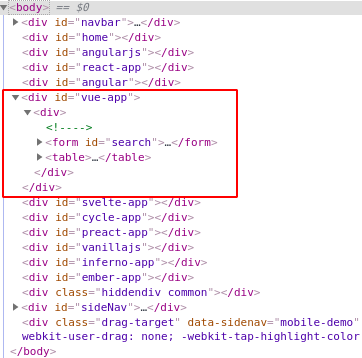
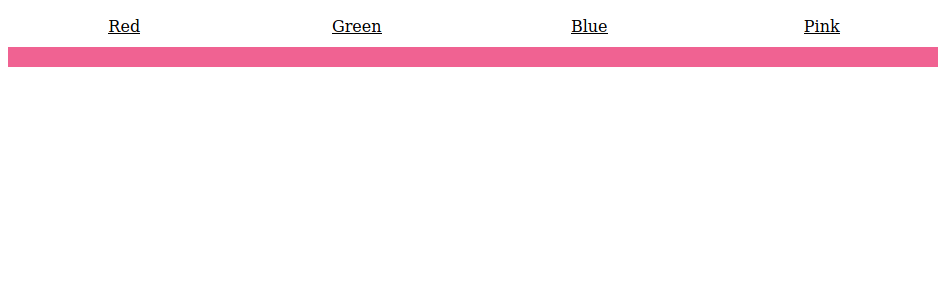

# single-spa.js

## 什么是 single-spa.js

**single-spa** 是一个可以把多种 JavaScript 框架所开发的应用聚合在一个应用的前端框架.

它有如下特点:

- 多个SPA的切换无需刷新
- 每个应用独立部署
- 兼容多元框架
- 懒加载

> 这是一个 single-spa 应用的[在线例子](https://single-spa.surge.sh)

从架构上来讲, single-spa 应用由两个部分组成:

- applications
- single-spa-config

### Applications

single-spa apps 会包含众多的 **SPA** 应用, 并且每一个应用都是一个完整的应用, 都可以从 DOM 中装载和卸载自身. 与传统的 **SPA** 相比, single-spa apps 最大的不同是它可以与其他的应用共存, 共享同一个 html page.

如果你的网络还不错, 一定已经打开了[在线例子](https://single-spa.surge.sh). 在元素检视面板可以看到很多 div.



这些 div 就像插槽一样, 在启动特定的应用时, 在对应的插槽装载元素. 而当应用不在是激活状态时, 又会从 DOM 中卸载掉该应用的元素. 并且, 所有的应用都共享着同一个 html 页.

### single-spa-config

single-spa-config 用于在 single-spa 中注册应用, 每个应用的注册需要如下 3 样东西:

1. application name
2. application load function
3. application active status switch function

## 从零开始

本教程的目标是在结束时, 完成零开始到集成完毕. 它共需要 6 步:

1. 初始化项目
2. 新建 html 文件
3. Registering
4. Create the home application
5. Create the navBar application
6. Create the angularJs application

### 初始化项目

随意新建一个文件夹, 例如 single-spa 作为本此尝试所使用的目录:

#### 0: 初始化目录

```bash
mkdir single-spa && cd single-spa
yarn init              # or npm init
yarn add single-spa    # or npm install --save single-spa
mkdir src
```

#### 1. 安装配置 Babel

```bash
yarn add --dev @babel/core @babel/preset-env @babel/preset-react @babel/plugin-syntax-dynamic-import @babel/plugin-proposal-object-rest-spread
```

#### 2. 安装配置 Webpack

single-spa 现阶段不得不使用 Webpack, 执行如下命令安装 Webpack, Webpack plugins, loaders.

```bash
# Webpack core
yarn add webpack webpack-dev-server webpack-cli --dev
# Webpack plugins
yarn add clean-webpack-plugin --dev
# Webpack loaders
yarn add style-loader css-loader html-loader babel-loader --dev
```

安装结束之后, 在根目录创建一个 `webpack.config.js` 文件, 贴入如下代码:

```js
const path = require('path');
const webpack = require('webpack');
const { CleanWebpackPlugin } = require('clean-webpack-plugin');
module.exports = {
  mode: 'development',
  entry: {
    // Set the single-spa config as the project entry point
    'single-spa.config': './single-spa.config.js',
  },
  output: {
    publicPath: '/dist/',
    filename: '[name].js',
    path: path.resolve(__dirname, 'dist'),
  },
  module: {
    rules: [
      {
        // Webpack style loader added so we can use materialize
        test: /\.css$/,
        use: ['style-loader', 'css-loader']
      }, {
        test: /\.js$/,
        exclude: [path.resolve(__dirname, 'node_modules')],
        loader: 'babel-loader',
      }, {
        // This plugin will allow us to use AngularJS HTML templates
        test: /\.html$/,
        exclude: /node_modules/,
        loader: 'html-loader',
      },
    ],
  },
  node: {
    fs: 'empty'
  },
  resolve: {
    modules: [path.resolve(__dirname, 'node_modules')],
  },
  plugins: [
    // A webpack plugin to remove/clean the output folder before building
    new CleanWebpackPlugin(),
  ],
  devtool: 'source-map',
  externals: [],
  devServer: {
    historyApiFallback: true
  }
};
```

#### 3. 配置 npm run scripts

打开根目录的 `package.json` 文件, 添加如下脚本:

```json
"scripts": {
  "start": "webpack-dev-server --open",
  "build": "webpack --config webpack.config.js -p"
},
```

### 新建 index.html 文件

在根目录新建一个 `index.html` 文件, 内容如下:

```html
<!DOCTYPE html>
<html lang="en">

<head>
  <meta charset="UTF-8">
  <meta name="viewport" content="width=device-width, initial-scale=1.0">
  <meta http-equiv="X-UA-Compatible" content="ie=edge">
  <title>single-spa</title>
</head>

<body>
  <div id="navBar"></div>
  <div id="home"></div>
  <div id="angularJS"></div>

  <script src="/dist/single-spa.config.js"></script>
</body>

</html>
```

如果有一些公共的样式什么的, 可以在此时一并引入到 `index.html` 中来.

由于 Webpack 随后会将 `single-spa.config.js` 输出到 `/dist` 目录, 所以single-spa 的配置文件的路径会是指向 `/dist` 的.

### 注册应用

通过配置 `single-spa.config.js` 注册应用, 可以告诉 single-spa 如何去引导、装载、卸载我们的应用.

在根目录创建一个 `single-spa.config.js` 文件, 内容如下:

```js
import { registerApplication, start } from 'single-spa';

registerApplication(
  // 注册的应用的名称
  'home',
  // 加载函数
  () => { },
  // 活动函数
  location => location.pathname === '' ||
    location.pathname === '/' ||
    location.pathname.startsWith('/home')
)

start();
```

该配置注册了一个 home app, 并分别指明了其名称、加载函数、活动函数.

#### 加载函数

`loadingFunction` 必须是一个 async 函数或者其他返回一个 `已决议 Promise` 的函数, 意思也是一样的.

当 loading 一个 app 时, 会首先调用本函数, 从这个角度来看, 定位有些像钩子函数.

#### 活动函数

`activityFunction` 必须是一个返回 boolean 值或其他可判断真假的值的纯函数, 当返回结果为真时, 本应用认为是活动状态.

### Home App

#### 初始化 home app

在 `src/` 目录下新建 `home/` 文件夹, 并且在 `Home/` 目录下新建两个 js 文件:

- home.app.js
- root.component.js

安装 react 依赖:

```bash
yarn add react react-dom single-spa-react react-router-dom react-transition-group
```

#### 定义 home app 生命周期

注册应用以后, single-spa 就已经开始监听应用的引导与状态了, 届时对应的 app 会对此做出响应.

`single-spa-react` 提供了将 react 注册为 `singleSpaReact` 所需的通用生命周期钩子, 可以很方便的注册.

`singleSpaReact` 需要 4 个参数:

1. React 实例
2. ReactDOM 实例
3. root 组件
4. domElementGetter 函数

打开 `src/home/home.app.js` 文件, 内容如下:

```js
import React from 'react';

import ReactDOM from 'react-dom';

import singleSpaReact from 'single-spa-react';

import Home from './root.component';

// 获取自己的槽
function domElementGetter () {
  return document.querySelector('#home');
}

// 对应三个钩子函数 bootstrap, mount, unmount
const reactLifecycles = singleSpaReact({
  React, ReactDOM, rootComponent: Home, domElementGetter
});

export const bootstrap = [reactLifecycles.bootstrap];

export const mount = [reactLifecycles.mount];

export const unmount = [reactLifecycles.unmount];
```

#### 构建 React app

打开 `src/home/root.component.js` 文件, 内容如下:

```js
import React from "react";
import { TransitionGroup, CSSTransition } from "react-transition-group";
import {
  BrowserRouter as Router,
  Switch,
  Route,
  Link,
  Redirect
} from "react-router-dom";
/* you'll need this CSS somewhere
.fade-enter {
  opacity: 0;
  z-index: 1;
}
.fade-enter.fade-enter-active {
  opacity: 1;
  transition: opacity 250ms ease-in;
}
*/
const AnimationExample = () => (
  <Router basename="/home">
    <Route
      render={({ location }) => (
        <div style={{position: 'relative', height: '100%'}}>
          <Route
            exact
            path="/"
            render={() => <Redirect to="/hsl/10/90/50" />}
          />
          <ul style={styles.nav}>
            <NavLink to="/hsl/10/90/50">Red</NavLink>
            <NavLink to="/hsl/120/100/40">Green</NavLink>
            <NavLink to="/rgb/33/150/243">Blue</NavLink>
            <NavLink to="/rgb/240/98/146">Pink</NavLink>
          </ul>
          <div style={styles.content}>
            <TransitionGroup>
              {/* no different than other usage of
                CSSTransition, just make sure to pass
                `location` to `Switch` so it can match
                the old location as it animates out
              */}
              <CSSTransition key={location.key} classNames="fade" timeout={300}>
                <Switch location={location}>
                  <Route exact path="/hsl/:h/:s/:l" component={HSL} />
                  <Route exact path="/rgb/:r/:g/:b" component={RGB} />
                  {/* Without this `Route`, we would get errors during
                    the initial transition from `/` to `/hsl/10/90/50`
                  */}
                  <Route render={() => <div>Not Found</div>} />
                </Switch>
              </CSSTransition>
            </TransitionGroup>
          </div>
        </div>
      )}
    />
  </Router>
);
const NavLink = props => (
  <li style={styles.navItem}>
    <Link {...props} style={{ color: "inherit" }} />
  </li>
);
const HSL = ({ match: { params } }) => (
  <div
    style={{
      ...styles.fill,
      ...styles.hsl,
      background: `hsl(${params.h}, ${params.s}%, ${params.l}%)`
    }}
  >
    hsl({params.h}, {params.s}%, {params.l}%)
  </div>
);
const RGB = ({ match: { params } }) => (
  <div
    style={{
      ...styles.fill,
      ...styles.rgb,
      background: `rgb(${params.r}, ${params.g}, ${params.b})`
    }}
  >
    rgb({params.r}, {params.g}, {params.b})
  </div>
);
const styles = {};
styles.fill = {
  position: "absolute",
  left: 0,
  right: 0,
  top: 0,
  bottom: 0
};
styles.content = {
  ...styles.fill,
  top: "40px",
  textAlign: "center"
};
styles.nav = {
  padding: 0,
  margin: 0,
  position: "absolute",
  top: 0,
  height: "40px",
  width: "100%",
  display: "flex"
};
styles.navItem = {
  textAlign: "center",
  flex: 1,
  listStyleType: "none",
  padding: "10px"
};
styles.hsl = {
  ...styles.fill,
  color: "white",
  paddingTop: "20px",
  fontSize: "30px"
};
styles.rgb = {
  ...styles.fill,
  color: "white",
  paddingTop: "20px",
  fontSize: "30px"
};
export default AnimationExample;
```

#### 定义 loading function

打开根目录下的 `single-spa.config.js` 文件, 修改 loading function:

```js
import { registerApplication, start } from 'single-spa';

registerApplication(
  // 注册的应用的名称
  'home',
  // 加载函数
  () => import('./src/home/home.app'), // <- here
  // 激活函数
  location => location.pathname === '' ||
    location.pathname === '/' ||
    location.pathname.startsWith('/home')
)

start();
```

这时候可以尝试启动一下.

Run `yarn start`, 如果一切正常的话, 将会成功启动, 并且看到如下页面:



### NavBar App

创建和注册 NavBar app 的过程与 Home app 非常的相似. 不同点在于 NavBar 会导出一个带有生命周期的对象并且通过懒加载的方式获取各个应用的对象.

#### 注册 navBar

在 `single-spa.config.js` 添加如下的代码:

```js
registerApplication(
  'navBar',
  () => import('./src/navBar/navBar.app.js').then(module => module.navBar),
  () => true
)
```

`navBar.app.js` 目前还没有, 不过随后就会创建.

由于 navBar 是需要始终显示的, 因此, activityFunction 这里固定返回一个 true.

#### 初始化 navBar app

在 src 目录下新建 navBar 目录, 并在其中分别创建 `navBar.app.js` 与 `root.component.js` 文件.

可以通过在根路径执行以下命令创建:

```bash
mkdir src/navBar
touch src/navBar/navBar.app.js src/navBar/root.component.js
```

#### 定义 navBar app 生命周期

打开 `navBar.app.js` 文件, 贴入下面的代码:

```js
import React from 'react';
import ReactDOM from 'react-dom';
import singleSpaReact from 'single-spa-react';
import NavBar from './root.component.js';
function domElementGetter() {
  return document.getElementById("navBar")
}
export const navBar = singleSpaReact({
  React,
  ReactDOM,
  rootComponent: NavBar,
  domElementGetter,
})
```

#### 编写 navBar app 页面

```js
import React from 'react'
import {navigateToUrl} from 'single-spa'
const NavBar = () => (
  <nav>
    <div className="nav-wrapper">
      <a href="/" onClick={navigateToUrl} className="brand-logo">single-spa</a>
      <ul id="nav-mobile" className="right hide-on-med-and-down">
        <li><a href="/" onClick={navigateToUrl}>Home</a></li>
        <li><a href="/angularJS" onClick={navigateToUrl}>AngularJS</a></li>
      </ul>
    </div>
  </nav>
)
export default NavBar
```

### AngularJs App

#### 初始化 AngularJs app

执行如下命令:

```bash
mkdir src/angularJS
cd src/angularJS
touch angularJS.app.js root.component.js root.template.html routes.js app.module.js gifs.component.js gifs.template.html
```

为了演示子应用内部路由效果, 这里需要添加一些包:

```bash
yarn add angular angular-ui-router single-spa-angularjs
```

#### 注册 AngularJs app

打开 `single-spa.config.js` 文件, 添加如下的代码:

```js
function pathPrefix(prefix) {
    return function(location) {
        return location.pathname.startsWith(prefix);
    }
}

registerApplication(
  'angularJS',
  () => import ('./src/angularJS/angularJS.app.js'),
  pathPrefix('/angularJS')
)
```

#### 定义 AngularJs app 生命周期

在 `angularJs.app.js` 文件中贴入如下代码:

```js
import singleSpaAngularJS from 'single-spa-angularjs';

import angular from 'angular';

import './app.module.js';
import './routes.js';

const domElementGetter = () => document.querySelector('#angularJS');

const angularLifecycles = singleSpaAngularJS({
  angular,
  domElementGetter,
  mainAngularModule: 'angularJS-app',
  uiRouter: true,
  preserveGlobal: false,
});

export const bootstrap = [
  angularLifecycles.bootstrap,
];

export const mount = [
  angularLifecycles.mount,
];

export const unmount = [
  angularLifecycles.unmount,
];
```

#### 配置 angular 应用

`app.module.js`

```js
import angular from 'angular';
import 'angular-ui-router';
angular
.module('angularJS-app', ['ui.router']);
```

`root.component.js`

```js
import angular from 'angular';

import template from './root.template.html';
angular
  .module('angularJS-app')
  .component('root', {
    template,
  });
```

`root.template.html`

```html
<div ng-style='vm.styles'>
  <div class="container">
    <div class="row">
      <h4 class="light">
        Angular 1 example
      </h4>
      <p class="caption">
        This is a sample application written with Angular 1.5 and angular-ui-router.
      </p>
    </div>
    <div>
    <!-- These Routes will be set up in the routes.js file -->
      <a class="waves-effect waves-light btn-large" href="/angularJS/gifs" style="margin-right: 10px">
        Show me cat gifs
      </a>
      <a class="waves-effect waves-light btn-large" href="/angularJS" style="margin-right: 10px">
        Take me home
      </a>
    </div>
    <div class="row">
      <ui-view />
    </div>
  </div>
</div>
```

`gifs.component.js`

```js
import angular from 'angular';

import template from './gifs.template.html';
angular
  .module('angularJS-app')
  .component('gifs', {
    template,
    controllerAs: 'vm',
    controller ($http) {
      const vm = this;
      $http
        .get('https://api.giphy.com/v1/gifs/search?q=cat&api_key=dc6zaTOxFJmzC')
        .then(response => {
          vm.gifs = response.data.data;
        })
        .catch(err => {
          setTimeout(() => {
            throw err;
          }, 0);
        });
    },
  });
```

`gif.template.html`

```html
<div style="padding-top: 20px">
  <h4 class="light">
    Cat Gifs gifs
  </h4>
  <p>
  </p>
  <div ng-repeat="gif in vm.gifs" style="margin: 5px;">
    
  </div>
</div>
```

#### 设置 AngularJs app 内部路由

`routes.js`

```js
import angular from 'angular';

import './gifs.component.js';
import './root.component.js';
angular
  .module('angularJS-app')
  .config(($stateProvider, $locationProvider) => {
    $locationProvider.html5Mode({
      enabled: true,
      requireBase: false,
    });
    $stateProvider
      .state('root', {
        url: '/angularJS',
        template: '<root />',
      })
      .state('root.gifs', {
        url: '/gifs',
        template: '<gifs />',
      });
  });
```

### 完成

虽然过程真的好繁琐, 但是不可否认以这种简单的例子来说确实成功了.

执行 `yarn start` 可以查看效果.